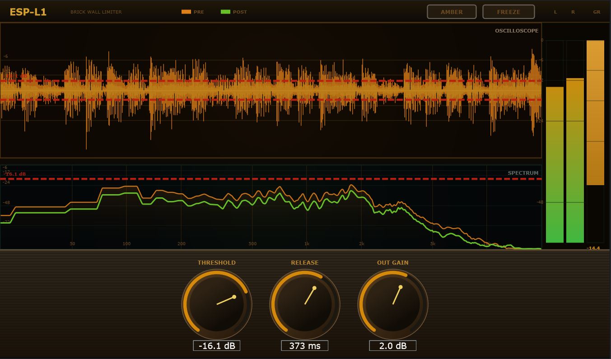

# ESP-L1 — Brick Wall Limiter


A VST3 / AU audio plugin developed in C++17 using the **JUCE Framework**. Implements a time-domain brick-wall limiter with a dual real-time analyzer: scrolling oscilloscope and frequency spectrum.



## ⚙️ DSP Architecture

* **Detection & Envelope:** Linked-stereo peak detection (`std::max` across channels per sample). Instantaneous attack (0 ms) with exponential release. The release coefficient is calculated from the host sample rate so timing stays consistent regardless of session settings.
* **Gain Reduction:** `GR = thresholdLinear / envelopeState` whenever the envelope exceeds the threshold.
* **Output Gain:** Post-reduction makeup gain applied before the output stage.

## 📊 Visualizers

* **Oscilloscope:** 131 072-sample ring buffer (~3 s at 44.1 kHz). Drawn as min/max bars per pixel for accurate peak representation. PRE and POST signals overlaid. Threshold shown as dashed overlay. FREEZE button locks the display.
* **Spectrum Analyzer:** 2048-point Hann-windowed FFT on both pre- and post-limiter signals. Logarithmic frequency axis (20 Hz – 20 kHz).
* **VU + GR Meters:** Stereo VU meter with analogue-style decay; GR meter shows instantaneous gain reduction in dB.

## 🎨 Themes

Three vintage-analog themes, cycled with the THEME button:

| Theme | Style |
|-------|-------|
| AMBER | Warm tube, amber/gold palette |
| PHOSPHOR | Green CRT phosphor monitor |
| STEEL | Dark rack-unit, steel blue |

## 🎛️ Parameters

| Parameter | Range | Default | Description |
|-----------|-------|---------|-------------|
| Threshold | -60 → 0 dB | 0 dB | Level above which GR engages |
| Release | 10 → 1000 ms | 100 ms | Exponential decay time (log-scaled knob) |
| Out Gain | -12 → +12 dB | 0 dB | Post-limiter makeup gain |

## 🚀 Build

### Option A — CMake (Windows & macOS, recommended)

**Requirements:** CMake ≥ 3.22, a C++17 compiler. JUCE is downloaded automatically.

```bash
cmake -B build -DCMAKE_BUILD_TYPE=Release
cmake --build build --config Release --parallel
```

For a macOS universal binary (Apple Silicon + Intel):
```bash
cmake -B build -DCMAKE_BUILD_TYPE=Release -DCMAKE_OSX_ARCHITECTURES="arm64;x86_64"
cmake --build build --config Release --parallel
```

Artifacts land in `build/BasicLimiter_artefacts/Release/`:
- `VST3/ESP-L1.vst3` — Windows & macOS
- `AU/ESP-L1.component` — macOS only (Logic Pro, GarageBand, etc.)

### Option B — Projucer / Visual Studio 2022 (Windows)

1. Open `BasicLimiter.jucer` in Projucer and verify your local JUCE module paths.
2. Export to Visual Studio 2022.
3. Open `Builds/VisualStudio2022/BasicLimiter.sln` and build the `BasicLimiter_VST3` target.
4. Copy the `.vst3` to your DAW's VST3 folder.

### Installing on macOS

- **VST3:** copy `ESP-L1.vst3` to `~/Library/Audio/Plug-Ins/VST3/`
- **AU:** copy `ESP-L1.component` to `~/Library/Audio/Plug-Ins/Components/`

## 📝 License

Open-source — free to use as a reference for JUCE DSP and lock-free GUI synchronization.
---

## 🔗 Download & more plugins

This plugin is part of the **ESP free plugin collection**.
Download it and find more free audio plugins at:

👉 **[esp-plugin-store.vercel.app](https://esp-plugin-store.vercel.app)**

